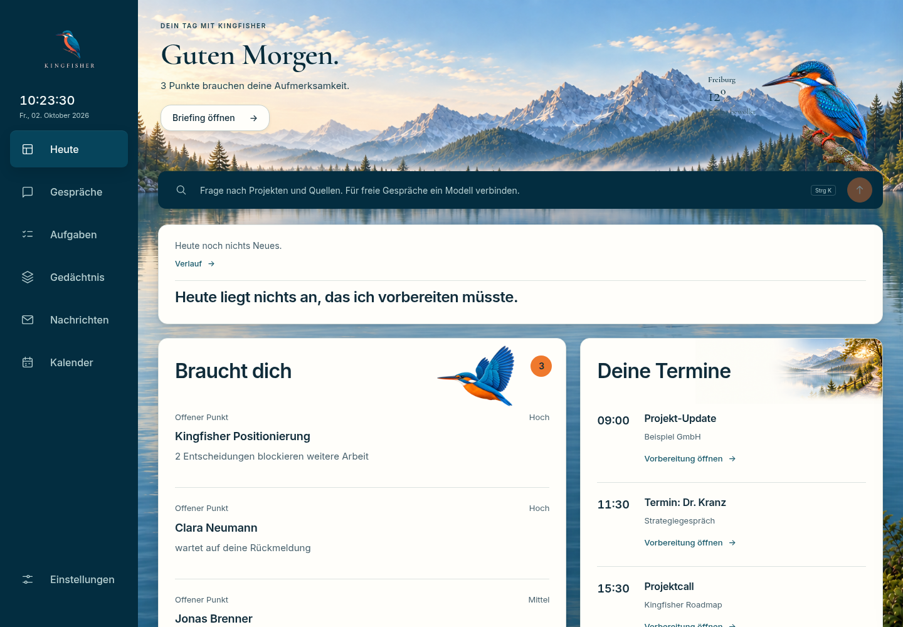

# Kingfisher

**Your personal chief of staff – local, with a memory you can check.**

Kingfisher brings conversations, mail, tasks and appointments together in one
place. The goal: know in the morning what matters, find connections again, and
get work done with explicit approval. The existing Icarus core provides the
local services. The app itself is in German.

**Auf Deutsch:** [Kingfisher starten](#kingfisher-starten-auf-deutsch).

**Status: active prototype.** Many everyday functions are implemented. Reliable
automatic interpretation and consolidation of the memory is still being built
and checked. Kingfisher is not yet a fully qualified, autonomous assistant. A
merge into `main` marks the integrated development state, not a release of every
planned capability.



*Screenshot of the running interface, taken on 2 October 2026 in an isolated
preview (`KINGFISHER_FIXTURE=morning`). Content, names and weather come from the
bundled, fictitious reference data set, not from connected accounts. No AI model
is connected in this preview.*

## Start Kingfisher

### On a Mac: download the app

1. Open the download page, **https://icarus-health.github.io/kingfisher-app/**, and
   click **Für Mac laden** (download for Mac).
2. Install [Docker Desktop](https://www.docker.com/products/docker-desktop/)
   (free) and open it once.
3. Open `Kingfisher.dmg` and drag the app into *Applications*. The first time,
   macOS blocks it because it is not from the App Store: on **macOS 15 or
   newer**, close the message, open **System Settings → Privacy & Security**
   and click **Open Anyway**; on **macOS 14 or older**, right-click the app,
   choose **Open**, then **Open** again.
4. Install [Ollama](https://ollama.com/download) (free) so Kingfisher can
   answer in its own words.

New versions arrive by themselves: Kingfisher offers them on *Heute* (Today),
backs up your data first and updates with one click. Once a day it asks
GitHub whether there is a new version; nothing about you is sent, and you can
switch it off under *Einstellungen → Kingfisher und du*. How releases work:
[docs/53-download-und-updates.md](docs/53-download-und-updates.md).

### From the source code: double-click

This is the way for developers and for anyone who wants to build Kingfisher
from the source code.

1. Download Kingfisher: on GitHub, **Code → Download ZIP**, then open the ZIP
   (it unpacks into a folder, for example in *Downloads*).
2. In that folder, double-click **`Kingfisher starten.command`**.
   The first time, macOS blocks the file because it is not from an identified
   developer. You allow it once:
   - **macOS 15 (Sequoia) or newer:** close the message with **Done**. Open
     **System Settings → Privacy & Security**, scroll down to the line about
     `Kingfisher starten.command` and click **Open Anyway**. Confirm with your
     password, then click **Open**.
   - **macOS 14 or older:** right-click (or Control-click) the file, choose
     **Open**, then **Open** again.
3. A window shows what is happening; you do not need to type anything in it.
   If something is missing, the window says so in one sentence and opens the
   download page:
   - **Docker Desktop** (free) runs Kingfisher in the background. If it is not
     installed, its download page opens; install it, open it once, then
     double-click the starter again. If it is installed but not running, the
     starter launches it.
   - **Apple's developer tools** (free): if they are missing, macOS offers them
     in a dialog; install them, then double-click the starter again.
   - **Ollama** (free) is the program Kingfisher thinks with on your
     computer. **Install it**: Kingfisher needs it to answer your questions
     and to sort people and projects in the background. If it is missing, the
     window gives you the link. Without Ollama, Kingfisher still reads your
     mail and calendar and shows your briefing; the setup step *Dieser
     Rechner* (this computer) then says that Ollama is missing, with the link,
     and you can add it at any time later.
4. The first start takes a few minutes. Then your browser opens
   `http://127.0.0.1:8890/today`, and a setup assistant guides you through name,
   mail, calendar and this computer. Every step can be skipped.

Next time, double-click the same file again; it takes seconds. You can drag it
into the Dock.

The setup assistant finds your mail server itself, also for your own domain
(club, practice, small business), and asks only for your password. Downloading
the language model is started with one click and continues in the background;
you can finish the setup and read your briefing meanwhile.

### Kingfisher starten (auf Deutsch)

**Der einfache Weg: die App von der Download-Seite.**

1. Die Download-Seite öffnen, **https://icarus-health.github.io/kingfisher-app/**,
   und **Für Mac laden** klicken.
2. [Docker Desktop](https://www.docker.com/products/docker-desktop/)
   (kostenlos) installieren und einmal öffnen.
3. `Kingfisher.dmg` öffnen und die App in „Programme“ ziehen. Beim ersten
   Öffnen hält macOS sie an, weil sie nicht aus dem App Store kommt:
   **macOS 15 oder neuer:** die Meldung schließen, **Systemeinstellungen →
   Datenschutz & Sicherheit** öffnen und **Dennoch öffnen** klicken;
   **macOS 14 oder älter:** die App mit der rechten Maustaste anklicken,
   **Öffnen** wählen, dann noch einmal **Öffnen**.
4. [Ollama](https://ollama.com/download) (kostenlos) installieren, damit
   Kingfisher in eigenen Worten antwortet.

Neue Fassungen kommen von selbst: Kingfisher bietet sie auf Heute an, sichert
vorher deine Daten und aktualisiert mit einem Klick.

**Aus dem Quelltext (für Entwickler), mit der Starter-Datei:**

1. Kingfisher herunterladen: auf GitHub **Code → Download ZIP**, dann die
   ZIP-Datei öffnen. Es entsteht ein Ordner, etwa unter *Downloads*.
2. In diesem Ordner **`Kingfisher starten.command`** doppelklicken. Beim ersten
   Mal blockiert macOS die Datei, weil sie nicht von einem bekannten Entwickler
   stammt. Das erlaubst du einmal:
   - **macOS 15 (Sequoia) oder neuer:** die Meldung mit **Fertig** schließen.
     **Systemeinstellungen → Datenschutz & Sicherheit** öffnen, nach unten zur
     Zeile über `Kingfisher starten.command` scrollen und **Dennoch öffnen**
     klicken. Mit deinem Passwort bestätigen, dann **Öffnen**.
   - **macOS 14 oder älter:** die Datei mit der rechten Maustaste (oder
     Control-Klick) anklicken, **Öffnen** wählen, dann noch einmal **Öffnen**.
3. Ein Fenster zeigt, was passiert; tippen musst du darin nichts. Fehlt etwas,
   sagt das Fenster es in einem Satz und öffnet die Downloadseite:
   - **Docker Desktop** (kostenlos) lässt Kingfisher im Hintergrund laufen.
     Installieren, einmal öffnen, dann den Starter noch einmal doppelklicken.
   - **Apple-Entwicklerwerkzeuge** (kostenlos): Fehlen sie, bietet macOS sie in
     einem Fenster an. Installieren, dann den Starter noch einmal doppelklicken.
   - **Ollama** (kostenlos) ist das Programm, mit dem Kingfisher auf deinem
     Rechner nachdenkt. **Installiere es**: Ohne Ollama beantwortet Kingfisher
     keine Fragen und ordnet im Hintergrund nicht ein, wer wer ist und was zu
     welchem Vorhaben gehört. Mails, Termine und dein Briefing gibt es auch
     ohne; der Schritt „Dieser Rechner“ im Assistenten sagt dann, dass Ollama
     fehlt, und nennt den Link. Nachholen kannst du es jederzeit.
4. Der erste Start dauert ein paar Minuten. Dann öffnet sich der Browser mit
   `http://127.0.0.1:8890/today`, und ein Assistent führt durch Name, Mail,
   Kalender und diesen Rechner. Jeden Schritt kannst du überspringen.

Beim nächsten Mal genügt ein Doppelklick auf dieselbe Datei; das dauert
Sekunden. Du kannst sie ins Dock ziehen.

### On Windows or Linux

There is no double-click starter for Windows yet. On Linux, with Docker
installed, run `python3 scripts/kingfisher_starten.py` from the downloaded
folder; it does the same as the Mac starter. Otherwise see
[For developers](#for-developers).

## What is already there

| Area | Implemented scope |
|---|---|
| Today | Daily overview, briefing and meeting preparation; weather optional |
| Conversations | Persistent local conversation history, memory proposals and visible action approvals |
| Tasks | Tasks, project assignment, progress states and history; proposals from messages |
| Messages | Several mail accounts, filters, reply drafts and sending with explicit approval |
| Calendar | Calendar sources and switchable views; limited direct answers about appointments with freshness checks |
| Memory | Searchable people and project directory, sources, confirmation and revocation, historical knowledge queries and processing status |
| Documents | Import and approved inbox folders, including transcript exports |
| Models | Ollama connection and exchangeable providers; technical readiness is not a qualification of the model |

The scope of an area does not guarantee that every combination of source, model
and request already works reliably. The current focus is correct identity,
temporal validity, source evidence and fitting follow-up questions. The
[model checks](docs/evaluations/model-selection/cos-diagnostic-2026-09-13/README.md)
explicitly show wrong answers of the tested local models as well.

Earlier [functional acceptance: 16 of 20 checkpoints = 80 %](docs/release/ACCEPTANCE-PROFILES-80.md).
**The memory and product release is still open.** Development now follows the
[memory-first roadmap](docs/release/MEMORY-FIRST-ROADMAP.md): correctness,
source and time reference, a learning working profile, speed and measurable
relief. The old percentage does not measure this quality.
[Controlled self-improvement](docs/release/CONTROLLED-IMPROVEMENT.md) is planned
as a further step; no autonomous code-changing service is running.

## Data and control

- Conversations and memory live locally in SQLite; no additional database
  service or cloud account is needed for the application.
- Sources are connected deliberately. A fresh download does not take over any
  personal mailboxes, credentials or existing Docker volumes.
- Local models are the default; optional cloud providers receive the input
  approved for their call. “Stored locally” does not automatically mean “every
  model call stays local”.
- External content is data, never permission for actions. Memory proposals and
  consequential actions have their own review and approval steps.
- When Kingfisher looks for the mail server of your own domain, only the domain
  leaves the computer: as a DNS query and as a request to that domain's own
  server, never to a third party.
- Credentials, `.kingfisher.env`, local source approvals, data directories and
  backups do not belong in a public fork.

## Backup

In the app: **Settings → Backup** creates an encrypted backup you can download.
From the command line, `make backup` creates a consistent full snapshot inside
the running Docker volume: conversations, memory, graph, tasks, projects,
sources, audit and local settings. A backup only becomes visible after manifest,
checksum and SQLite integrity checks; the last 14 full snapshots are kept. The
encrypted key file is backed up if it lives in the volume, but **never** the
local `.kingfisher.env`: keep its passphrase safe separately, otherwise stored
secrets cannot be decrypted after moving to another computer.

## For developers

**New to the repository?** The [developer entry point](docs/DEVELOPER-START.md)
(German) covers the current state, code map, tests and next work packages. It
is also the entry point for Claude Code and external reviewers.

### Start from the terminal

Requirements: Git, Docker with Compose, `make` and `openssl`. Docker must be
running. For local AI, a reachable Ollama is needed as well; models are loaded
from the setup assistant, not by this command.

```sh
git clone https://github.com/Icarus-health/kingfisher-app.git
cd Kingfisher
make start
```

The app runs only at `http://127.0.0.1:8890/today`. Token, passphrase and the
persistent Docker volume are separate from the earlier Icarus channel.
`make url` prints the local address; the browser session is set by Kingfisher as
HttpOnly, without putting the key into the URL. `make logs` follows what the
sidecar does, `make stop` stops it (memory and keys stay). The double-click
starter (`scripts/kingfisher_starten.py`) uses the same Compose project and
`.kingfisher.env` as `make start`.

`make aktualisieren` switches a checkout to the newest released image: it
backs up first (as a pre-update backup), pulls
`ghcr.io/icarus-health/kingfisher-app:<version>`, sets `KINGFISHER_IMAGE` in
`.kingfisher.env` and restarts; if the new version does not come up, the
previous one runs again and `make zurueck-vor-update` restores the data. To
build from source again, delete the `KINGFISHER_IMAGE` line. Publishing a
version (`VERSION`, `docs/fassungen/<version>.md`, tag `v<version>`) is
described in [docs/53-download-und-updates.md](docs/53-download-und-updates.md).

On a computer with an existing Kingfisher installation, check its containers and
volumes first: the Compose project name is fixed, so a second checkout does not
create a separate data instance. For review and experiments, use separate
volumes and ports.

### Mac app with its own window

For an already set-up local Docker instance, a small Finder/Dock launcher with
the Kingfisher logo can be built:

```sh
python3 scripts/build_mac_launcher.py \
  --env-file .kingfisher.env \
  --container kingfisher-kingfisher-1 \
  --url http://127.0.0.1:8890
```

The app is placed at `~/Applications/Kingfisher.app`. Double-clicking starts the
existing Docker runtime if needed and opens Kingfisher in the default browser.
For a window without address and bookmarks bar there is
`scripts/build_mac_window.py` with the same parameters and an additional
`--output PATH.app`; it uses `macos/KingfisherApp.swift` and needs the Xcode
Command Line Tools. The launcher contains no credentials; it points to the local
configuration and the project folder, which must stay in place. The locally
built app is ad-hoc signed, not notarized for distribution. Closing the browser
does not stop the Docker service; use `make stop` for that.

For the deterministic visual reference data set, set
`KINGFISHER_FIXTURE=morning` temporarily in `.kingfisher.env`. Weather stays off
by default; only after explicit activation with place and coordinates does
Kingfisher query current values from Open-Meteo.

### Visual source

The unchanged design source lives in `design-source/`. Its priority:

1. `06_Screens/Approved` (the screen mockups were removed before publication; the index files remain)
2. `07_Coding_Package/KINGFISHER-ASSET-MANIFEST-v1.json`
3. approved brand, icon, media, font and token files
4. older repository documentation

Unapproved deviations are not implemented. Approved, narrowly scoped deviations
are documented in `docs/screen-deviations/`.

### Architecture

- React, TypeScript and Vite in `app/kingfisher/`
- FastAPI and the existing Icarus services in `sidecar/`
- SQLite files in the persistent `kingfisher-data` volume
- one multi-stage container, running as an unprivileged user

There is exactly one interface (React) and one delivery path (Docker, on the Mac
with a native window as shell). The earlier technical interface and the Tauri
shell were removed ([ADR 0008](docs/adr/0008-docker-und-mac-fenster.md)).

### Tests and next steps

Backend tests: `make test` after setting up the development environment with
`make sidecar-dev`. Frontend: `cd app/kingfisher && npm ci && npm run build`.
The full local check is `scripts/ci_lokal.sh`.

Next, model performance and actual memory retrieval are checked separately and
then combined in complete everyday workflows. Automatic profile layers,
comprehensive semantic consolidation and further computer execution are not yet
guaranteed product features.

- [Memory: implementation and open requirements](docs/release/MEMORY-CORE-IMPLEMENTATION-2026-09-12.md)
- [Current memory and context work](docs/release/MEMORY-CONTINUATION-2026-09-13.md)
- [Local models: measurements and limits](docs/evaluations/model-selection/cos-diagnostic-2026-09-13/README.md)
- [Roadmap](docs/release/ROADMAP-STATUS.md) – percentages refer to the documented acceptance list, not to the whole vision.
