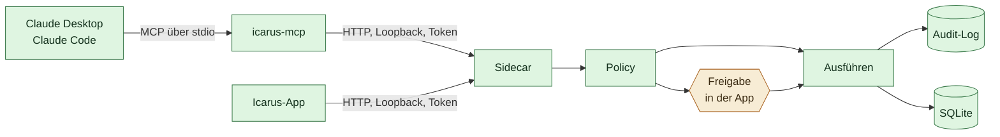
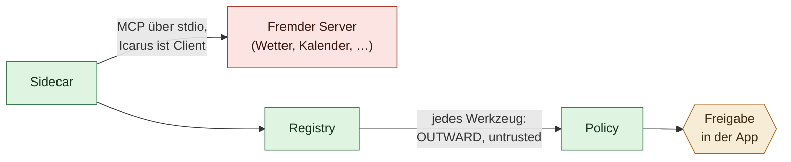

# Die MCP-Tür

Stand 2026-09-29. Verbindlich für `sidecar/icarus_memory/mcp.py` und
`mcp_client.py`.

## Vorgabe: aus

**Die MCP-Tür ist in beide Richtungen ausgeschaltet.** Ohne ausdrückliche
Einstellung kommt kein fremder Assistent herein, und Icarus startet keinen
fremden Server. Es ist eine Expertenfunktion, und die meisten brauchen sie
nicht; also ist „aus“ die Entscheidung für fast alle.

Eingeschaltet wird sie vor dem Start des Sidecars, nicht in der Oberfläche:

```bash
KINGFISHER_MCP_TUER=1
```

Gilt `1`, `true`, `ja`, `an`; alles andere ist aus. Der Schalter wird bei jedem
Aufruf gelesen (`config.mcp_tuer_offen`).

Ist die Tür aus, antworten diese Routen mit **403** und dem Satz „Die
MCP-Anbindung ist ausgeschaltet; sie lässt sich mit KINGFISHER_MCP_TUER=1 vor
dem Start von Icarus einschalten.“: `/tools`, `/tools/{name}`, `/context`,
`/mcp/tuer`, `/mcp/server` (GET, POST, DELETE) und `/mcp/pruefen`. 403 statt
404, weil der Aufrufer angemeldet ist und die Funktion gewollt fehlt — die
Meldung soll sagen, wie man sie einschaltet. Das Token wird zuerst geprüft.
`icarus-mcp` reicht den Satz als Fehlermeldung an den Assistenten durch und
fragt vor jedem Zugriff nach, auch für `icarus_heute` und `icarus_freigaben`,
deren Endpunkte die App selbst benutzt. Beim Start werden bei ausgeschalteter
Tür keine eingetragenen Fremdserver gestartet; die Einträge bleiben in den
Einstellungen stehen.

Die ältere Oberfläche unter `app/src/` nutzt `/tools/mail_senden`,
`/context` und `/mcp/*`; die React-Oberfläche unter `app/kingfisher/` nutzt
keine davon. Mit ausgeschalteter Tür funktionieren diese Stellen der alten
Oberfläche nicht mehr.

### Auch bei eingeschalteter Tür gesperrt

- **Kein direktes Schreiben in den Bestand.** `merken`,
  `episode_festhalten` und `gedaechtnis_vorschlagen` verweigert `Agent.invoke`
  jedem Aufrufer von außen und schreibt die Absage ins Audit-Log. Die Absage
  bittet darum, es in Icarus selbst zu sagen.
  Sie stehen auch nicht in `/tools`. Verdichtung schlägt vor, sie schreibt nicht
  (siehe [`10-verdichtung.md`](10-verdichtung.md)); das gilt für einen
  Assistenten von außen erst recht.
- **Kontext höchstens `normal`.** `/context` (`icarus_kontext`) liefert immer
  nur Aussagen mit Schutzbedarf `normal`, gleich wie das Hausmodell eingestellt
  ist — wie `icarus_gedaechtnis_suchen`.
- **Fremde Server sehen nichts vom Sidecar.** Ein angedockter Server startet
  mit einer minimalen Umgebung (`PATH`, `HOME`, `USER`, `SHELL`, `LANG`,
  `LC_*`, `TMPDIR` und wenige mehr) plus dem, was bei seiner Angabe ausdrücklich
  unter `umgebung` steht. API-Schlüssel und `ICARUS_SIDECAR_TOKEN` erbt er nie.
- **Werkzeugnamen der Cloud-Schnittstellen.** Angedockte Werkzeuge heißen
  `dienst__werkzeug`, nur aus `[A-Za-z0-9_-]`, höchstens 64 Zeichen.
  Zusammenfallende Namen bekommen `_2`, `_3`.

Icarus ist eine App mit eigenem Gespräch. Daneben stehen auf demselben Rechner
Assistenten, die schon benutzt werden — Claude Desktop, Claude Code, andere.
Sie können alles Mögliche, aber sie vergessen zwischen zwei Sitzungen alles.

Die MCP-Tür schließt genau diese Lücke: Sie gibt fremden Assistenten Zugang zu
**demselben** Gedächtnis, das die App benutzt. Kein zweiter Bestand, keine
zweite Freigabeliste, kein zweites Protokoll.

## Was sie ausdrücklich nicht ist

Kein zweites System. Der Server öffnet **keine** eigene Datenbank, sondern
spricht über HTTP mit dem laufenden Sidecar.



Drei Gründe, und alle drei sind der Grund:

**Freigaben landen dort, wo ein Mensch sitzt.** Beantragt ein fremder
Assistent etwas Außenwirksames, wird es nicht ausgeführt — der Antrag erscheint
in der Icarus-App und wartet dort. Bauten wir hier einen zweiten Stapel, gäbe es
eine zweite Freigabeliste, die niemand ansieht. Das ist die Art Lücke, die man
erst bemerkt, wenn sie benutzt wurde.

Ehrlich dazu: Das ist eine Abmachung der Brücke, kein technischer Schutz gegen
einen Assistenten mit Shell. `icarus-mcp` bietet kein Werkzeug an, das einen
Antrag bestätigt — aber ein Assistent, der Befehle auf dem Rechner ausführen
darf, kann `verbindung.json` lesen (Token, gleicher Benutzer) und den Sidecar
direkt ansprechen, auch die Bestätigung eines Antrags samt Phrase. Die Phrase
steht im Antrag selbst. Ein Token für alles trennt dort nichts. Deshalb ist die
Tür standardmäßig aus, und deshalb gilt sie nur für Assistenten, denen der
Nutzer ohnehin Zugriff auf seinen Rechner gibt. Getrennte Token je Aufgabe
(Tür, App) sind offen, siehe unten.

**Ein Audit-Log.** Was über diese Tür kam, steht im selben Protokoll wie alles
andere, mit demselben Werkzeugnamen und derselben Aktionsklasse. Erkennbar,
nicht versteckt.

**Ein Bestand.** Zwei Prozesse auf derselben SQLite-Datei wären technisch
machbar und fachlich falsch: Die Regeln des Selbstmodells — Ersetzung, Ablauf,
kaskadierender Widerruf — leben im Store, nicht in der Datei. Wer die Datei
umgeht, umgeht die Regeln.

## Was durchgesetzt ist

Der Aufruf geht durch `Agent.invoke()` und damit durch `_handle()` — dieselben
vier Schritte wie im Gespräch:

| Prüfung | Gilt über MCP |
| --- | --- |
| Grenzen aus dem Selbstmodell (`kind: constraint`) | ja, und sie führen zu `denied` |
| Anhebung nach fremdem Inhalt (`tainted`) | ja |
| Freigabe bei außenwirksamen Aktionen | ja, als Antrag in der App (Brücke bietet keine Bestätigung an, siehe oben) |
| Direktes Schreiben (`merken`, `episode_festhalten`) | nein, verweigert |
| Audit-Eintrag, auch bei Verweigerung | ja |

Was **nicht** über diese Tür geht: Der Chat-Endpunkt. Ein fremder Assistent
soll nicht das Modell im Haus anstoßen können — das wäre eine Kette aus zwei
Modellen, bei der niemand mehr sagen kann, wessen Absicht ausgeführt wurde.

Belegt in `tests/test_mcp.py`, die Absicherung der Tür (Schalter, Absage
beim Schreiben, Deckel des Kontexts, Umgebung, Namen) in
`tests/test_mcp_tuer.py`. Sie laufen gegen den echten
Sidecar-Stapel über einen ASGI-Transport, nicht gegen nachgebaute Antworten:
Eine Brücke, die nur mit Attrappen geprüft ist, beweist über die Brücke nichts.

Die zentrale Zusicherung — außenwirksames Handeln kommt über diese Tür nicht
durch — wurde durch Sabotage geprüft: `invoke()` an der Policy vorbei
verdrahtet, vier Tests fielen mit der erwarteten Meldung, zurückgebaut.

## Protokoll

JSON-RPC 2.0 über stdin/stdout, zeilenweise. Unterstützt: `initialize`,
`ping`, `tools/list`, `tools/call`, dazu leere Antworten auf `prompts/list` und
`resources/list`, weil Clients die beim Verbinden ungefragt abfragen.

Bewusst von Hand statt über ein SDK. Es sind vier Methoden, und eine
Abhängigkeit, die sich im Halbjahrestakt ändert, ist für eine App, die zehn
Jahre laufen soll, der schlechtere Tausch — dieselbe Überlegung wie bei IMAP
und CalDAV statt Anbieter-APIs (siehe [`01-architektur.md`](01-architektur.md)).

## Werkzeuge

Alle tragen das Präfix `icarus_`, damit sie in einem Client neben Dutzenden
anderer erkennbar bleiben.

| Werkzeug | Klasse | Zweck |
| --- | --- | --- |
| `icarus_kontext` | read | Was Icarus über den Nutzer weiß — wörtlich, samt Quellen und Aktualitätsurteil |
| `icarus_heute` | read | Tagesüberblick: Projekte, Aufgaben, Termine, Nachrichten |
| `icarus_freigaben` | read | Was in der App auf eine Entscheidung wartet |
| ~~`icarus_merken`~~ | — | Nicht mehr angeboten: schriebe ohne Vorschlag in den Bestand |
| `icarus_gedaechtnis_suchen` | read | Das Selbstmodell durchsuchen |
| `icarus_projekte`, `icarus_projekt_stand` | read | Projektliste und vollständiger Stand eines Projekts |
| `icarus_projekt_anlegen`, `icarus_projekt_status` | write_local | Projekte anlegen und fortschreiben |
| `icarus_notiz_anlegen`, `icarus_notizen_suchen`, `icarus_notiz_lesen` | write_local / read | Notizen |
| `icarus_aufgaben`, `icarus_aufgabe_anlegen`, `icarus_aufgabe_erledigt` | read / write_local | Aufgaben |
| `icarus_mail_senden`, `icarus_termin_anlegen` | outward | Nur mit Freigabe in der App |

`icarus_notiz_lesen` ist als `returns_untrusted` markiert. Eine Notiz kann aus
einer Mail oder einem Transkript stammen; Herkunft ist nicht
Vertrauenswürdigkeit.

## Einrichtung

Der Sidecar schreibt beim Start `verbindung.json` ins Datenverzeichnis — Port
und Token, die die App bei jedem Start neu vergibt. Ohne diese Datei müsste
beides von Hand eingetragen und nach jedem Neustart erneuert werden. Sie
enthält ein Token und liegt deshalb mit `0600` in einem Verzeichnis mit `0700`.

In der Konfiguration des Assistenten:

```json
{
  "mcpServers": {
    "icarus": {
      "command": "/pfad/zu/icarus-mcp"
    }
  }
}
```

Vorher muss die Tür eingeschaltet sein (`KINGFISHER_MCP_TUER=1`, siehe oben),
sonst antwortet `icarus-mcp` mit „Die MCP-Anbindung ist ausgeschaltet …“.

Zum Ausprobieren gegen einen von Hand gestarteten Sidecar schlagen
Umgebungsvariablen die Datei:

```bash
ICARUS_SIDECAR_URL=http://127.0.0.1:8765 ICARUS_SIDECAR_TOKEN=… icarus-mcp
```

## Die andere Richtung: Icarus dockt an

Die eine Richtung — fremde Assistenten dockt an Icarus an — ist oben
beschrieben. Icarus kann seit `sidecar/icarus_memory/mcp_client.py` auch
umgekehrt: an einen fremden MCP-Server andocken und dessen Werkzeuge benutzen.

Das ist die Antwort auf die Frage „was brauchen wir noch, um einen digitalen
Chief of Staff zu haben?“, ohne für jeden Dienst einen eigenen Konnektor zu
schreiben. Jeder Dienst, für den irgendwer einen MCP-Server geschrieben hat,
dockt an — ohne dass hier eine Zeile dafür entsteht.



### Was dabei nicht verhandelbar ist

**Jedes angedockte Werkzeug ist `returns_untrusted`.** Seine Ausgabe ist
fremder Inhalt — sie verseucht den Zug, hebt die Freigabestufe, und **keine
Dauerregel senkt sie wieder**. Ein angedockter Dienst erweitert, was Icarus
**kann**, nicht, wem es **glaubt**. Siehe [`03-delegation.md`](03-delegation.md)
für die Kontaminationsregel im Allgemeinen.

**Jedes angedockte Werkzeug ist `OUTWARD`.** `tools/list` kennt kein Feld für
die Wirkung eines Werkzeugs. Ein Name wie `send_message` sieht nach Versand
aus, aber danach zu raten hieße, eine Sicherheitszusage an eine Zeichenkette
zu hängen, die der fremde Server frei wählt. Die Voreinstellung ist deshalb
die vorsichtige: gefragt wird jedes Mal, bis ein Mensch für diesen einen
Dienst etwas anderes einträgt.

### Protokoll

Wie beim Server: JSON-RPC 2.0 über stdin/stdout, von Hand statt über ein SDK.
Vier Methoden reichen (`initialize`, `notifications/initialized`,
`tools/list`, `tools/call`), und eine Abhängigkeit, die sich im
Halbjahrestakt ändert, ist für eine App, die zehn Jahre laufen soll, der
schlechtere Tausch — dieselbe Überlegung wie bei IMAP und CalDAV statt
Anbieter-APIs.

Der fremde Server läuft als eigener Kindprozess, mit minimaler Umgebung
(siehe oben). Zeitlimits gelten für jeden
Aufruf; ein Server, der nicht antwortet, hält Icarus nicht an. Der Start
erfolgt **ohne Shell** — die Befehlszeile kommt aus der Einstellungsdatei, und
eine Shell würde daraus mehr machen als einen Start.

### Einrichtung

Ein Name und eine Befehlszeile, wie man sie der Anleitung des Dienstes
entnimmt (`npx -y @dienst/server`), über die API (`POST /mcp/pruefen`, `POST /mcp/server`); die
frühere Oberfläche „Mehr → Einrichtung → Angedockte Dienste“ gibt es nicht mehr,
in der React-Oberfläche fehlt dafür noch ein Bereich. „Verbinden und nachsehen“ startet den Dienst probeweise und zeigt,
welche Werkzeuge dabei herauskamen, ohne etwas einzutragen. Erst „Andocken“
schreibt den Eintrag fest — und auch das erst, nachdem der Dienst wirklich
gestartet ist. Ein Eintrag, der nie funktioniert hat, soll gar nicht erst in
der Liste stehen.

## Was offen ist

**Das Token wechselt bei jedem Start der App.** Der MCP-Server liest
`verbindung.json` einmal beim Start. Startet die App danach neu, meldet er
`Token abgelehnt` samt Hinweis, statt still zu scheitern — aber er liest die
Datei nicht neu ein. Solange Clients MCP-Server ohnehin nur beim eigenen Start
hochfahren, ist das erträglich; sauber ist es nicht.

**Ein Token für alles.** Wer das Token hat, erreicht jede Route des Sidecars,
nicht nur die der Tür. Der Schalter sperrt die Routen der Tür, trennt aber
keine Berechtigungen. Getrennte Token (eines für die App, eines nur für die
Tür mit Zugriff auf deren Routen) wären der saubere Schritt.

**Der Vorschlagsweg fehlt der Tür noch.** `gedaechtnis_vorschlagen` hält den
Vorschlag nur im Gesprächszug fest; über `Agent.invoke` gibt es diesen Zug
nicht. Das Werkzeug meldete dort Erfolg, ohne dass ein Vorschlag entstand, und
ist deshalb für die Tür gesperrt. Ein fremder Assistent kann derzeit nichts
vorschlagen, nur den Nutzer bitten, es in Icarus zu sagen.

**Keine Herkunftsunterscheidung im Selbstmodell.** Wünschenswert wäre erkennbar,
*welcher* Assistent etwas eingetragen hat — das ist genau die Nachvollziehbar­
keit, die das Projekt sonst überall einfordert. Solange die Tür nicht direkt
schreibt, betrifft das vor allem Notizen, Aufgaben und Projekte.

**Keine eigene Freigabestufe für die Tür.** Ein fremder Assistent hat für
alles, was nicht das Gedächtnis betrifft, dieselben Rechte wie das Modell in
der App. Denkbar wäre, `write_local` über MCP grundsätzlich auf `confirm` zu
heben. Ob das nötig ist oder nur nervt, entscheidet der Betrieb — dieselbe
offene Frage wie bei `confirm_strict` in [`04-roadmap.md`](04-roadmap.md).

## Verwandte Dokumente

- [`01-architektur.md`](01-architektur.md) — die zwei Speicher und ihr Verhältnis
- [`03-delegation.md`](03-delegation.md) — Aktionsklassen und Freigabestufen
- [`05-sicherheit.md`](05-sicherheit.md) — fremde Inhalte und Prompt Injection
- [`06-gedaechtnis-kontrakt.md`](06-gedaechtnis-kontrakt.md) — die Regeln des Bestands
