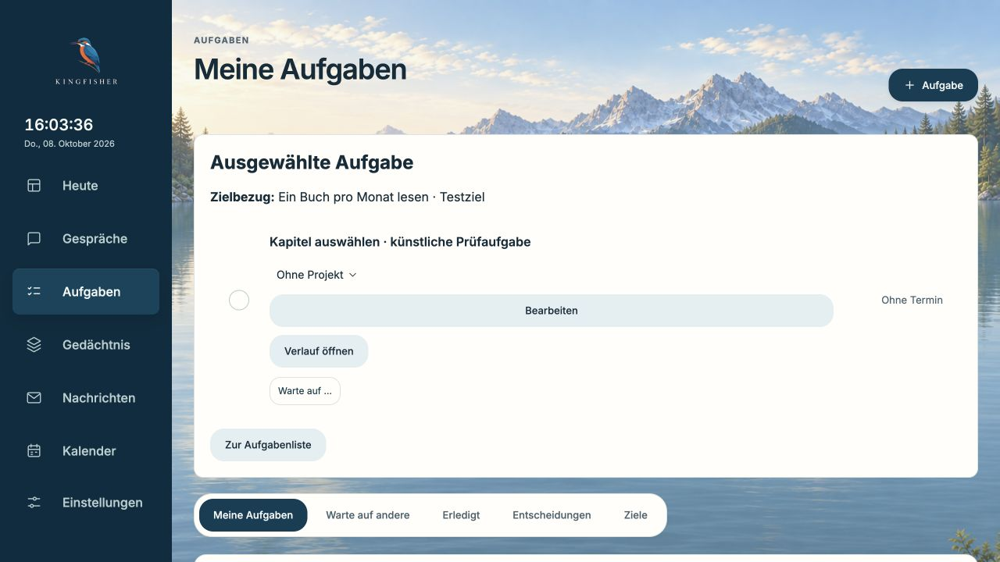
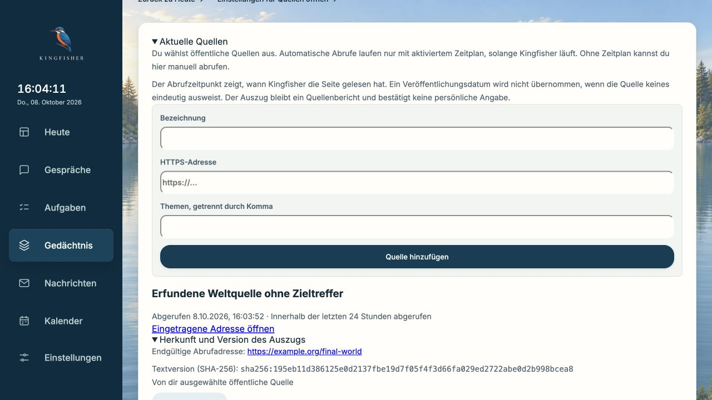
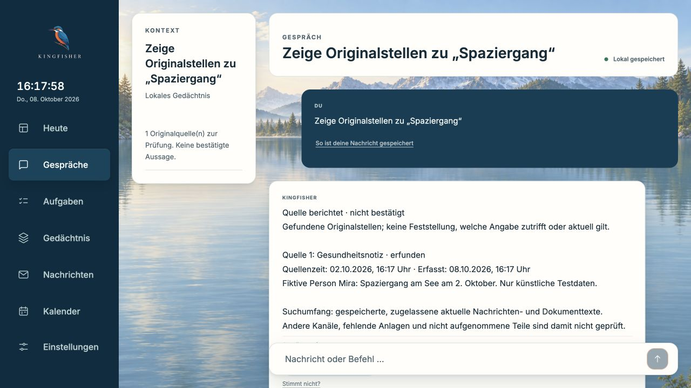

# CoS-Arbeitsraum, öffentliche Quellen und vollständiger Gedächtnisabruf

8. Oktober 2026. Implementierung bis `da5b0e6`. Dieser Lieferstand verbindet vorhandene Funktionen und korrigiert konkrete Fehler; er ist **keine Abnahme eines fehlerfreien oder vollständig nutzbaren CoS**.

## Geliefertes Verhalten

- Ziele haben einen ausdrücklich angelegten nächsten Arbeitsschritt als strukturierte Aufgabenbeziehung. Historische Aufgaben behalten den Zielbezug; fehlende, zurückgezogene, erledigte Ziele und Gewohnheiten können keine neue Zielaufgabe erhalten. Alte Aufgaben ohne Beziehung bleiben lesbar.
- Persönliche Entwicklung verbindet bestehende Ziele, Gewohnheiten und Lernvorschläge. Gesundheit und andere Gedächtnisbereiche wählen im gesamten berechtigten Quellenbestand vor der Seitengrenze; eine leere geladene Seite steht nicht mehr für einen leeren Gesamtbestand.
- „Heute“ führt direkt zu Entwicklung, Gesundheit, Gedächtnisprüfung und `/world`. Öffentliche registrierte Quellen bleiben auch ohne Ziel-Schlagworttreffer sichtbar. Endgültige Abrufadresse und SHA-256 des gespeicherten Textes sind nachvollziehbar. Ein fehlgeschlagener Abruf überschreibt keinen erfolgreichen Auszug. Ein Wechsel der Redirect-Adresse erzeugt eine andere Provenienz; eine zurückgezogene frühere Fassung wird bei einer Rückkehr ihres Inhalts nicht still wieder freigegeben.
- Die vorhandene Prüfung der Aussagebelege ist über `/review` erreichbar. Sie erneuert keine Wahrheit oder Aktualität durch bloße Bearbeitung.
- „Zeige Originalstellen zu …“ erreicht den wörtlichen Quellenweg ohne Modellaufruf. Ein echter Bedienversuch fand die zuvor fehlende Erkennung; Regression und erneuter Bedienversuch bestätigen die Korrektur.
- Modelle dürfen keine Zeitfilter hinzufügen, die die Frage nicht nennt. Ein unbekanntes Quelldatum wird in Satzbelegen, Aktenfristen und Aufgabenvorschlägen nicht mehr durch das Importdatum ersetzt. Datumsangaben im Anzeige-Kopf sind keine zusätzlichen Inhaltsbelege. Absolute Jahresdaten aus dem Quelltext bleiben verwendbar; Sortierung und Erfassungszeiten bleiben erhalten. Alte Antworten werden beim Anzeigen neu geprüft, der abgeleitete Aktenstand wird mit Version 3 neu berechnet. Keine Originaldatenmigration.

## Unabhängige Prüfungen und echte Antworten

Eine frische Diff-Prüfung fand drei Fehler: Redirect-Provenienz konnte auf einen alten Eintrag zeigen; ungültige Quellenreferenzen konnten aus der Messung verschwinden; Modellfehler konnten fälschlich als erfolgreiche Nichtantwort zählen. Reproduziert und korrigiert. Der zusätzliche Zeitschutz entstand aus der inhaltlichen Prüfung tatsächlich generierter Antworten, nicht aus einem angenommenen grünen Teststatus.

`before-source-time-guard.json` zeigt den Arbeitsstand vor dem Zeitschutz. Trotz korrekter Quellenlinks erfand das lokale Modell in vier Antworten Kalenderpräzision: Wartung am Donnerstag wurde zu 08.10.2026, Anruf nach 10 Uhr zweimal zu einem Datum und „Ende Oktober“ zu 31.10.2026. Die Messung allein hätte diese Antworten als Quellen-Erfolg gewertet.

`full-answer-da5b0e6.json` ist der wiederholte echte `Agent.answer_memory`-Weg mit installiertem **qwen3.5:4b**, lokalem **bge-m3**, eingeschalteter Bedeutungssuche, echter Satzerzeugung und demselben Modell als zusätzlichem Satzprüfer. Port 11436 war ein eigener lokaler Testdienst. Kein Download, keine privaten Quellen, kein Cloudaufruf; Dienste nach dem Lauf beendet. 104 Modellaufrufe, 185,67 Sekunden für 36 Fragen, keine gemeldeten Modellfehler oder offenen Modellaufrufe. Das 4B-Modell belegte bei der vorigen Ressourcenabfrage etwa 3,2 GB für geladene Modellgewichte mit 4096 Kontext; das ist keine Messung des Gesamtprozesses oder eines Alltags-Akkutests.

| Eingefrorene Fragen | Exakt angezeigte erwartete Quellen | Quellen plus Statuskriterium |
| --- | ---: | ---: |
| Direkt | 16/16 | 15/16; einmal berechtigte Rückfrage nach fehlendem Quelldatum |
| Umschrieben | 8/16 | 8/16 |
| Nicht beantwortbar | 4/4 ohne Quellen | 4/4 Nichtantwort |

Kataloghash: `7cae3b03694957bfa363b8d9fedbf4d01cdff9b572a149c6c2c98c24fea8230b` — der genaue Hash ist zusätzlich im JSON gespeichert; der Katalog wurde nicht nachgebessert. Die Einordnung der 16 synthetischen Originale ist **deterministisch**, daher wird damit keine Modell-Aufnahmequalität gemessen. Ein Quellenfund ist keine korrekte Aussage; das Statuskriterium enthält kein unabhängiges fachliches Gold. Der Satzprüfer ist dasselbe Modell, keine unabhängige Wahrheitsinstanz.

Die unabhängige Inhaltsdurchsicht des wiederholten Laufs bestätigt: Die vier vorher erfundenen Datumsangaben erscheinen nicht mehr; bei verworfener Modellformulierung bleibt der Originalwortlaut mit unbekannter Quellenzeit. Sie findet weiterhin acht ausgelassene Umschreibungen, mögliche Aktualitätsmissverständnisse bei jahr- und undatierten Fristen sowie die kleine, aber reale Abschwächung von „erst nach 10 Uhr“ zu „ab 10 Uhr“. Diese Grenzen bleiben offen; der Lauf ist **kein allgemeiner Fehlerfreiheitsnachweis**.

Quellenentzug wurde an einer bereits gespeicherten Antwort geprüft: nach Entzug `working_unavailable`, keine weiter angezeigten Quellenlinks.

## Bediennachweise

Ausschließlich künstliche Daten, getrennte lokale Vorschau, keine angeschlossenen Konten:

1. Heute → Entwicklung → nächsten Schritt anlegen → Aufgabe öffnen → Neuladen: Zielbezug bleibt.
2. Heute → öffentliches Wissen → Quelle ohne Zieltreffer → künstlicher Abruf → Herkunft/Version → Originalauszug. Der Abruf selbst war ein Fixture, **kein Live-Web-/SSRF-Nachweis**; der Zugriffsschutz wird separat getestet.
3. Breite 390 px: kein horizontaler Überlauf; Herkunftsdetails und Quellenaktionen erreichbar.
4. Review → Aussagen prüfen: der vorhandene Belegprüfbereich wird korrekt ausgewählt.
5. Heute → „Zeige Originalstellen zu ‚Spaziergang‘“: künstliche Gesundheitsnotiz ohne Modellaufruf, Quelldatum und Erfassung getrennt, klar unbestätigt.

## Offene Produktabnahme

Priorität bleiben Abruf bei Umschreibungen, zeitliche Anwendbarkeit und Informationsabdeckung. Die acht Fehlfälle dürfen nicht mit einer Liste ihrer Testwörter oder einem angepassten Katalog kaschiert werden. Nächster begrenzter Schritt: Kandidatenfund und Modellauswahl getrennt messen; originale Frage und vorhandene Umschreibungen getrennt vergleichen; Änderungen an einer unabhängigen Kontrollmenge mit ähnlichen Namen, negativen Freigaben und fehlenden Daten gegenprüfen.

Persönliche Konten, Ordner, Zeiträume, Anlagen und Kalender sind weiter gegen den wirklichen Ausgangsbestand abzugleichen. Die allgemeine Alltags-, Kalender-Schreib- und Akkutest-Abnahme steht aus. Pulse/Atlas/Voice/Learning werden über passende vorhandene Kingfisher-Wege ausgebaut; dieser Stand behauptet keine fertigen neuen Health-, Sprachdialog-, Infrastruktur- oder WhatsApp-Integrationen. LifeOS war Referenz; in dieser Lieferung wurde kein Fremdcode kopiert und kein zweiter Gedächtnisdienst installiert.

## Technische Abschlussprüfung

Am finalen Code-Stand `da5b0e6`: **5245 bestanden, 2 übersprungen**, 824,15 Sekunden für Sidecar, vollständige Gedächtnisdiagnostik und Mac-App-Tests. Zwei bestehende Warnungen (Starlette/httpx und Escape-Schreibweise). Frontend **375 bestanden**, Produktionsbuild erfolgreich; bestehender Hinweis auf die große JavaScript-Datei bleibt.

Das aus einem sauberen Git-Archiv gebaute lokale Containerbild meldet `1.0.6-local.da5b0e6`; `/today`, `/development`, `/world` und `/review` sowie die World-API sind erreichbar. Ein separater Client ohne gültigen Header oder Sitzung erhält 401. Der erste Smoke-Test hatte irrtümlich eine gültige Browsersitzung wiederverwendet; die korrigierte Prüfung trennt diese Sitzungen. Dafür war keine Produktänderung nötig.

GitHub-CI wird wegen des bekannten Minutenlimits nicht neu gestartet. ## Mac-Installation

Installiert ist **`1.0.6-local.da5b0e6`**, lokales Bild `sha256:a13f2bbdc14ce374da3cfede14250d29fc8fd470d08bcc75ea5b8ba5e168f3d5`. Der bestehende native Starter ist bytegleich; nur Bundle-Fassung und Signatur wurden aktualisiert. Kein neues öffentliches Release oder Container-Upload; der normale öffentliche Updater liefert diese lokale Vorschau nicht aus.

Vor dem Austausch wurde bei gestopptem Container eine vollständige Sicherung von App, Umgebung und Daten erstellt. Das Datenvolume ist dasselbe. Alle **344 gespeicherten Einträge** haben unveränderte IDs und Inhaltsdigests; **17 SQLite-Speicher** bestehen die Integritätsprüfung davor und danach. Konto-, Kalender-, Modell- und Zeitplaneinstellungen sind unverändert. Health, authentifizierte exakte Fassung und neue World-API antworten korrekt. Keine neue Cloudfreigabe und kein ausdrücklicher Großimport gestartet.

Der erste Installationscheck erwartete irrtümlich `operational` von einer im normalen Modus nicht vorhandenen Inspection-Route. Der automatische Rückfall stellte App und Umgebung erfolgreich wieder her. Nach Korrektur des Installationschecks wurde erneut vollständig gesichert und erfolgreich aktualisiert; beide Rückfallpakete bleiben privat außerhalb des Repositorys erhalten. Kein Produktcode musste dafür geändert werden.

Die **native Bedienprüfung nach dem Austausch bleibt offen**, weil der Mac beim Öffnen gesperrt war. Die oben dokumentierten Browserabläufe auf künstlichen Daten sind davon getrennt und bestanden. Ein offenes Fenster oder der allgemeine Alltags-/Akkutest werden nicht behauptet.
