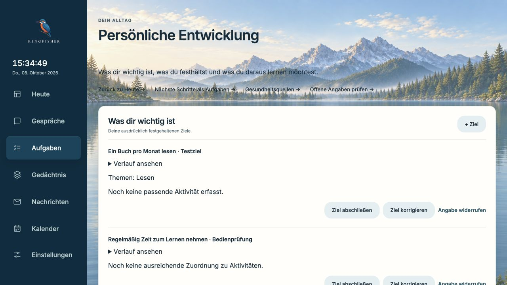
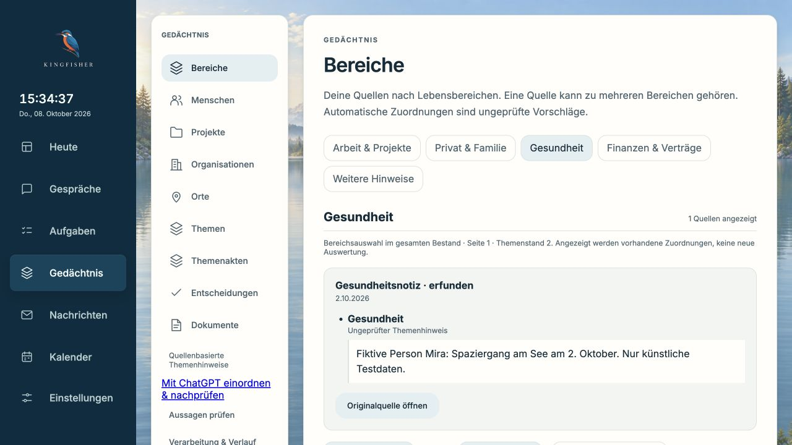

# Persönlicher Arbeitsbereich: erste LifeOS-inspirierte Ausbaustufe

8. Oktober 2026; Ausgangsstand `776abb5`, Branch `feat/core-workflow-20261007`.
Eigenständige Kingfisher-Implementierung, kein kopierter LifeOS-Produktcode.

## Geliefertes Verhalten

- Gedächtnisbereiche wählen passende Kandidaten **vor** der Seitengrenze aus.
  Eine alte Gesundheitsquelle hinter 60 neueren Projektquellen bleibt erreichbar.
  Pro Anfrage werden höchstens 500 Kandidaten anhand des aktuellen Originals
  geprüft, höchstens 100 ausgegeben (UI: 50). Eine begrenzte Suche hat einen
  Fortsetzungscursor, auch wenn ihr erster Abschnitt leer ist. Es werden keine
  corpusweiten Vollständigkeitszahlen erfunden. Datenbankauswahl kann den
  Gesamtbestand lesen; 500 ist die Grenze für Kandidatenvalidierung, keine
  behauptete Grenze der gesamten SQL-Arbeit.
- Manuelle Kategorien gehen vor automatischen Hinweisen. Quellenänderung,
  veralteter Fingerabdruck oder Entzug verhindern falsche Bereichstreffer.
  Die Ansicht löst keine neue Einordnung aus und migriert keine Daten.
- „Für dich“ auf Heute führt mit einem Klick zu persönlicher Entwicklung,
  Gesundheitsquellen und Gedächtnisprüfung – auch ohne Tagesereignisse.
- `/development` verbindet vorhandene Ziele, Gewohnheiten und Lernvorschläge.
  Korrektur, Abschluss, Wiederaufnahme, Verlauf und Rücknahme bleiben erhalten.
  Es gibt noch keine explizite Aufgabenverknüpfung je Ziel und keine neuen
  Gesundheitsmesswerte. Das UTC-Tagesmodell der vorhandenen Check-ins bleibt
  ausdrücklich gekennzeichnet.
- Bereichslinks entfernen konkurrierende Personen-/Statusparameter.
  Alte Ladeantworten dürfen den neueren Bereich nicht ersetzen; die vorherige
  Seite wird während einer neuen Anfrage nicht unter falschem Titel gezeigt.

## Prüfungen

- Neue Bereichsregressionen zuerst auf ungeändertem Verhalten fehlschlagend,
  danach bestanden: ältere Quelle, manuelle Übersteuerung, aktueller Original-
  Fingerabdruck, Entzug, ungültiger Bereich und begrenzte Fortsetzung.
- Unabhängiges Review fand die fehlende direkte Serverroute `/development`
  und konkurrierende Queryparameter. Beide mit reproduzierenden Tests korrigiert;
  Nachreview bestätigt, keine weiteren konkreten Probleme gefunden.
- Abschließender betroffener Backendumfang: **128 bestanden**, eine vorhandene
  Starlette-TestClient-Abkündigungswarnung. Enthält Bereiche, Kategorien,
  Mail-Aufnahmerouten, Browser-/Containerzugriff, Ziele, Gewohnheiten, Lernen
  und Quellenfassungen. Kein unnötiger vollständiger Backendlauf.
- Frontend: **369 bestanden**, Typprüfung und Produktionsbuild bestanden.
  Bestehende Warnung zum großen JavaScript-Bundle bleibt offen.
- Offline-Abrufprobe mit unverändertem synthetischem Katalog:
  **16/16 direkte Fragen**, **2/16 Umschreibungen**, **0/4 unbeantwortbare Fragen
  mit Kandidaten**. Kein Netzwerk und kein Modell. Vollständiges Ergebnis:
  [paraphrase-offline.json](paraphrase-offline.json).
  Dies misst Kandidaten der Wortsuche, keine fertigen Antworten oder die gesamte
  kombinierte Suche. Die schwache Umschreibungssuche bleibt ein offener Kernpunkt.

## Tatsächliche Bedienprüfung auf dem Mac

Getrennte lokale Vorschau auf `127.0.0.1:8894` mit erfundenen Quellen,
Selbstmodell, Zielen und Gewohnheiten. Kein Schlüsselbundladen, kein Anbieter,
keine Konten, automatischer Zeitplan aus; Update-Abfragen im Test ausgeschaltet.
Die installierte App und deren laufende Aufnahme wurden nicht verändert.

Im In-App-Browser geprüft:

1. Heute ohne Termine/Nachrichten → Für dich → persönliche Entwicklung;
   direkte Servernavigation und Neuladen liefern die echte Oberfläche.
2. Ziel und Gewohnheit über die Oberfläche gespeichert, nach Neuladen erhalten.
   Ziel abgeschlossen, im Verlauf sichtbar, wieder aufgenommen.
3. Check-in erfasst und zurückgenommen; beobachteter Wochenzähler 0 → 1 → 0.
4. Vorbereitete drei künstliche Check-in-Tage → Beobachtungen prüfen →
   Lernvorschlag mit Belegen → Übernehmen → nach Neuladen „Von dir bestätigt“.
   Bestätigung zurückgenommen → „Nicht mehr als gültiges Wissen verwendbar“.
5. Gesundheitslink → alte Gesundheitsnotiz trotz 60 neuerer Projektquellen →
   Original geöffnet, weiterhin als Quelle und ungeprüfter Hinweis gekennzeichnet.
6. Personenprüfung → Bereiche → Gesundheit → Neuladen bleibt Gesundheit;
   Arbeitsquellen über zwei Seiten (50 und 10) erreichbar.
7. Desktop 1280×720 und schmale Darstellung 390×844 geprüft;
   Entwicklung hat bei 390 px keine horizontale Überbreite.
   Keine beobachteten Konsolenfehler oder Warnungen. Keine Fehlerüberlagerung.

Die neuen asynchronen Ladegrenzen wurden im Review gelesen, aber absichtlich
verzögerte Antworten und ein provozierter HTTP-Ausfall nicht im Browser simuliert.
Die Browserprobe behauptet keine geprüften realen Konten, Audioausgabe,
Modellantwortqualität oder Alltagstauglichkeit mit vollständigem Mailbestand.

## Bereitstellung und offene Ausbaustufen

Code und Nachweise im bestehenden Draft-PR. Keine neue öffentliche Version,
kein Merge, keine Aktualisierung der persönlichen Mac-Installation in diesem
Schritt; die Testvorschau wird nach der Prüfung beendet.

[Erweiterter LifeOS-Vergleich](../../evaluations/lifeos-2026-10-08.md) trennt
Pulse, Atlas, Voice, Learning und Synapse nach vorhanden/geliefert/offen.
Vorrang behalten vollständige Abrufqualifikation, gezielte Aktualitätsprüfung,
explizite nächste Schritte je Ziel und datierte Gesundheitswerte. Voice-Dialog
und optionales Geräteinventar sind noch keine fertigen Funktionen.
